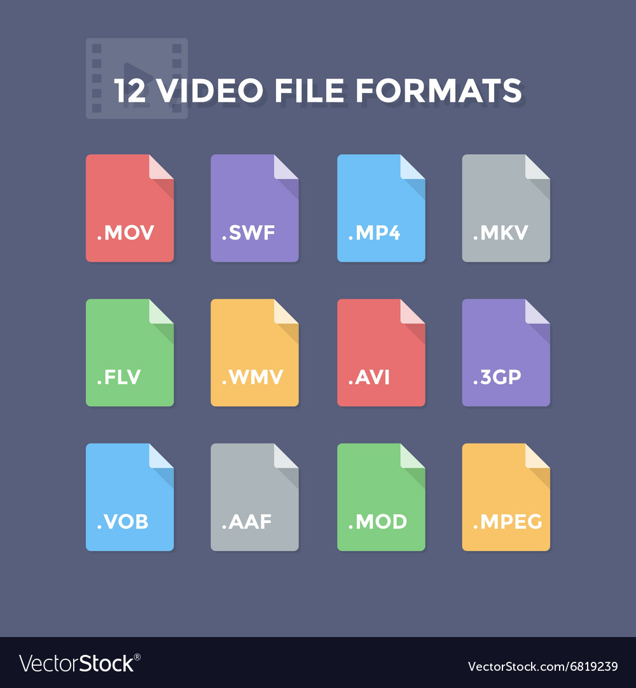
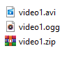
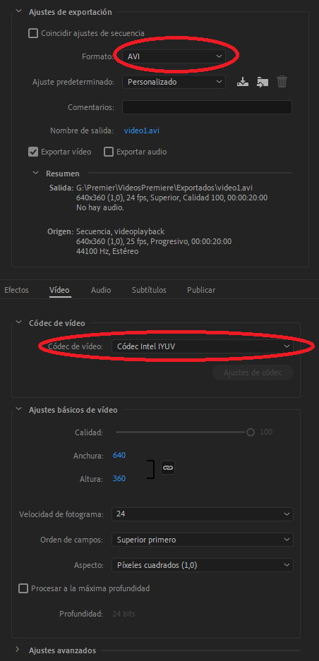

# Video Player

# Links
- [Vfw.h documentation](https://docs.microsoft.com/en-us/windows/win32/api/vfw/)
- [Presentation](https://docs.microsoft.com/en-us/windows/win32/api/vfw/) X
- [Handout](https://docs.microsoft.com/en-us/windows/win32/api/vfw/) X
- [Solution](https://github.com/MHF13/VideoPlayer/tree/main/Solution) 
- [Release](https://docs.microsoft.com/en-us/windows/win32/api/vfw/) X

# My goal 
The objective of this research has been the implementation of a video player in a project structure as similar as possible to the one used in the project 2 subject at the university.
The method that we will see is not the best, I'm sure about that, but it can be useful if our objective is to reproduce a small video. 

# Format & codecs
.avi, .mkv, .mp4, .ogg, .png
Whether for video, audio, image, etc...
These formats allow us to identify what type of data they contain, but something important to keep in mind is the codec used for the data in the format. 


A basic example we can have with the .mp4 format, which is the most used and which in turn uses the most used codecs are H.264 for video, a codec that has become a standard for high definition videos, and AAC for audio, which although it is a lossy digital audio compression, gives a high compression with the highest possible quality. 

# What is used in the industry? 
## Bink 
This tool is practically an industry standard.
Since March 1999 with the sixth generation, going through an update in 2013 with Bink 2 and until today it has been the most used for its fomidable decompression efficiency.
Its use was not cheap $ 8,500, but depending on your needs it was worth it.
Although in January 2021 Epic Games acquired the company to which it belongs (RAD Game Tools) to implement it in Unreal Engine, so it will be with us much longer and possibly more accessible. 


## Unity 
How hard it can be to play a video in Unity?
<iframe width="560" height="315" src="images/UnityVideo.mp4" frameborder="0" allow="accelerometer; autoplay; encrypted-media; gyroscope; picture-in-picture" allowfullscreen></iframe>

# What has been used? 
### State machine
In the Update of 'VideoPlayer' we see a state machine that will play and end the video.
- [START] Play the audio and access the first frame.
- [PLAY] Will access the frames as the video progresses to the end of it.
- [FINISH] Call the function that will disable the video player.

# TODOs
If you download the Release and open the Handout you can, following these TODOs, implement a video player in a small project. To do this we will use Vfw.h, which is a header which is available in windows without having to download anything. 

## TODO 0
Before starting, you have to unzip the video so that it can be read by our program.
Go to "\Output\Assets\Video" and unzip the file called video1.zip, it is important that the video and audio have the same name. 



### Do you want to put another video? 
Do you remember the part about formats and codecs? For our videoplayer use in .avi format video codec Intel IYUV.
You can specify the code when you export with premier, we will use these options. 



For audio, we can export with audacity in .ogg format.


## TODO 1
We will start by calling the video player at the moment we want it to start, in this case at the Start of Scene by calling the StartVideo function which will return a Boolean.
We will match it to the variable videoActive, it tells us that has started playing a video.
It is important that the path is unformatted so that it can be used for both audio and video. 
```
bool Scene::Start()
{
  ...
  // TODO 1: Play video
  videoActive = app->video->StartVideo("Assets/Video/video1");
  ...
}
```
### TODO 1.1
To access the audio and video files, we will copy the path into 2 char * and add the corresponding extension to each one of them. 
```
bool VideoPlayer::StartVideo(char* filePath)
{
  ...
  // TODO 1.1: We make the paths for the video and audio files from the filePath 
  int size = strlen(filePath);
  int nieuwSize = size + 5;
  audio = (char*)malloc(nieuwSize);
  strcpy_s(audio, nieuwSize, path.GetString());
  strcat_s(audio, nieuwSize, ".ogg");

  video = (char*)malloc(nieuwSize);
  strcpy_s(video, nieuwSize, path.GetString());
  strcat_s(video, nieuwSize, ".avi");
  ...
}
```
## TODO 2
We initialize the AVIFile library and we will access the AVI file and its data. 
The module already includes the necessary library (#include <Vfw.h>).
```
bool VideoPlayer::StartVideo(char* filePath)
{
  ...
  // TODO 2: Activate the library and access the video information 

  // The AVIFileInit function initializes the AVIFile library.
  AVIFileInit();

  // Open input AVI file
  AVIFileOpenA(&fileAVI, (LPCSTR)video, OF_SHARE_DENY_WRITE, NULL);

  // Get file info
  AVIFileInfo(fileAVI, &fileInfo, sizeof(AVIFILEINFO));
  // Save width and height of video
  width = fileInfo.dwWidth;
  height = fileInfo.dwHeight;

  // Get video stream
  AVIFileGetStream(fileAVI, &fileStream, streamtypeVIDEO, 0);
  if (fileStream == NULL)
  	LOG("Failed To Open The AVI Stream");
  ...
}
```
## TODO 3
In order for our program to synchronize with the video's FPS, we will obtain its frame with a few simple operations and we will change the program's FPS to that of the video.
Also, we will save the framerate to restore it at the end of the video. 
```
bool VideoPlayer::StartVideo(char* filePath)
{
  ...
  // TODO 3: Set the program to the framerate of the video 
  nFrames = AVIStreamLength(fileStream); // Video frames  
  timeVideo = AVIStreamLengthTime(fileStream) / 1000; // Video time in seconds 

  FPS = nFrames / timeVideo; // fps of the video 
  prevFPS = app->GetFramerate(); // Save actual framerate
  app->ChangeFPS(FPS); // Change FPS
  ...
}
```
### TODO 3.1
Once the reproduction has finished we will have to restore the framerate of the program.
```
bool VideoPlayer::CleanUp()
{
  ...
  // TODO 3.1: Restore FPS 
  app->ChangeFPS(prevFPS);
  ...
}
```
## TODO 4
Unzip the frames of the stream and store it in frmSequence
```
bool VideoPlayer::StartVideo(char* filePath)
{
  ...
  /* 
  TODO 4: Decompressing the frames of the video stream 
  This function returns a PGETFRAME
  We will be able to visualize individual frames of an open sequence.
  */
  frmSequence = AVIStreamGetFrameOpen(fileStream, NULL);
  if (frmSequence == NULL)
  	LOG("Failed To Open The AVI Frame");
  ...
}
```
## TODO 5
In order to obtain a frame of the video to draw on the screen must follow the following steps:
1. Create a bitmap of the desired frame
2. Store a pointer to bitmapData
3. Obtain a surface of the desired frame
4. Create a texture from the surface
At the end of this function we will increase the index. 
```
void VideoPlayer::NextFrame()
{
  // TODO 5: Create a texture of the current frame 
  // Create a bitmap for select frame
  LPBITMAPINFOHEADER bitmap = NULL;
  bitmap = (LPBITMAPINFOHEADER)AVIStreamGetFrame(frmSequence, frameIndex);
  
  // Pointer to bitmap data
  pointerData = (char*)bitmap + bitmap->biSize + bitmap->biClrUsed * sizeof(RGBQUAD); 

  // Create a surface of the current frame
  surface = SDL_CreateRGBSurfaceFrom(pointerData, width, height, bitmap->biBitCount, width * 3, 0, 0, 0, 0);
  
  // Get the texture 
  textureFrame = app->tex->LoadSurface(surface);

  // Next frame
  frameIndex++;
}
```
## TODO 6
In the first state of the state machine we will make the audio play. 
```
bool VideoPlayer::Update(float dt)
  ...
  {
    // TODO 6: Play music
    app->audio->PlayMusic(audio);
    ...
  }
  ...
```
### TODO 6.1
We must also stop the music once the video is finished.
```
bool VideoPlayer::CleanUp()
{
  ...
  // TODO 6.1: Stop the music 
  Mix_HaltMusic();
  ...
}
```
## TODO 7
We paint the texture of the current frame but it will only be done during the PLAY state It is important that both, the texture and the surface are released to avoid memory leaks 
```
bool VideoPlayer::PostUpdate()
{
  if (state == PLAY)
  {
    // TODO 7: Draw the texture of the frame.(180 angle because the image obtained is rotated)
    app->render->DrawTexture(textureFrame, (WINDOW_W / 2) - (width / 2), (WINDOW_H / 2) - (height / 2), NULL, 0, 180);
  
    // TODO 7:To avoid memory overload, we will UnLoad the texture and free the surface after each frame is painted. 
    app->tex->UnLoad(textureFrame);
    SDL_FreeSurface(surface);	
  }
  return true;
}
```
### TODO 7.1
We must also release the texture and the surface when the reproduction ends 
```
bool VideoPlayer::CleanUp()
{
  ...
    // TODO 7.1:Remember to unload the texture and free the surface here too.
    app->tex->UnLoad(textureFrame);
    SDL_FreeSurface(surface);
  ...
}
```

# TODO BONUS

 
